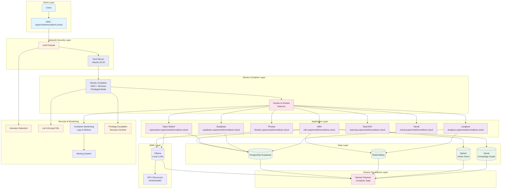
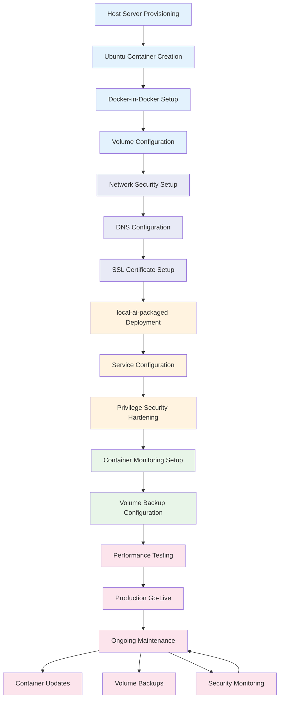

# Production Deployment Plan for local-ai-packaged (Containerized Ubuntu Server)

## Executive Summary

This comprehensive production deployment plan outlines the step-by-step process for deploying local-ai-packaged to production on supersmartinnovations.cloud using a containerized Ubuntu server architecture. The plan covers Docker-in-Docker setup, privileged container security, nested networking, persistent volume management, and migration procedures to ensure a robust, secure, and scalable containerized production environment.

## Phase 1: Infrastructure and DNS Setup

### 1.1 Ubuntu Container Provisioning
- **Host Server Specifications**: Ubuntu 22.04 LTS host, minimum 32GB RAM, 12-core CPU, 1TB SSD (additional resources for container overhead)
- **Container Specifications**: Ubuntu 22.04 container, 16GB RAM allocated, 8 CPU cores, 500GB storage
- **Docker-in-Docker Setup**: Privileged Ubuntu container running local-ai-packaged services
- **Cloud Provider**: DigitalOcean Droplet or AWS EC2 instance
- **Network Configuration**:
  - Host public IP assignment
  - Container bridge networking with port forwarding
  - Private networking enabled for inter-container communication
### Containerized Architecture Overview



### Containerized Deployment Workflow



  - Firewall configuration targeting host ports
  - Docker network creation for service isolation
  - Port forwarding from host to Ubuntu container to nested services

### 1.2 DNS Configuration
#### Primary Domain: supersmartinnovations.cloud
```
A     supersmartinnovations.cloud          [SERVER_IP]
A     www.supersmartinnovations.cloud     [SERVER_IP]
AAAA  supersmartinnovations.cloud          [SERVER_IPV6] (optional)
AAAA  www.supersmartinnovations.cloud     [SERVER_IPV6] (optional)
```

#### Service Subdomains
```
A     n8n.supersmartinnovations.cloud           [SERVER_IP]
A     openwebui.supersmartinnovations.cloud     [SERVER_IP]
A     flowise.supersmartinnovations.cloud       [SERVER_IP]
A     supabase.supersmartinnovations.cloud      [SERVER_IP]
A     searxng.supersmartinnovations.cloud       [SERVER_IP]
A     neo4j.supersmartinnovations.cloud         [SERVER_IP]
A     langfuse.supersmartinnovations.cloud      [SERVER_IP]
```

#### DNS Propagation
- TTL settings: 3600 seconds (1 hour)
- DNS propagation monitoring: Use tools like `dig` or online DNS checkers
- Verification commands:
  ```bash
  dig n8n.supersmartinnovations.cloud
  nslookup openwebui.supersmartinnovations.cloud
  ```

## Phase 2: Network Security Configuration

### 2.1 Unifi Firewall Setup
#### Firewall Rules - Allow
```
# HTTPS (443/TCP) - From anywhere
# HTTP (80/TCP) - From anywhere (redirect to HTTPS)
# SSH (22/TCP) - From admin IPs only
```

#### Firewall Rules - Deny
```
# All other ports - Drop all
# ICMP flood protection - Enable
# SYN flood protection - Enable
# UDP flood protection - Enable
```

### 2.2 Port Forwarding Configuration for Containerized Setup
#### Host to Ubuntu Container Port Forwards
```
External 80 → Host 80 → Ubuntu Container 80 (HTTP)
External 443 → Host 443 → Ubuntu Container 443 (HTTPS)
SSH (22/TCP) → Host 22 (direct to host for management)
```

#### Nested Container Port Forwarding
```
Ubuntu Container → DinD Services:
- 5678 → N8N
- 3000 → Open WebUI
- 3001 → Flowise
- 3002 → Supabase
- 8080 → SearXNG
- 7474 → Neo4j
- 3003 → Langfuse
```

#### Additional Considerations
- Port knocking for SSH access (optional advanced security)
- VPN setup for administrative access
- Rate limiting at firewall level

### 2.3 Network Security Best Practices
- **DMZ Setup**: Consider placing server in DMZ if additional network segmentation required
- **Intrusion Detection**: Enable Unifi IDS/IPS features
- **Traffic Monitoring**: Enable DPI (Deep Packet Inspection)
- **VPN for Admin**: Require VPN for all administrative access

## Phase 3: Service Security Hardening

### 3.1 Ubuntu Container Creation and Security Setup
```bash
# On host server: Update system packages
sudo apt update && sudo apt upgrade -y

# Install Docker and essential security packages
sudo apt install -y docker.io docker-compose-plugin ufw fail2ban unattended-upgrades

# Start and enable Docker
sudo systemctl enable docker
sudo systemctl start docker

# Create Ubuntu container with privileged access for DinD
docker run -d --name ubuntu-server \
  --privileged \
  --restart unless-stopped \
  -p 80:80 -p 443:443 \
  -v ubuntu-data:/data \
  -v /var/run/docker.sock:/var/run/docker.sock \
  -e DOCKER_TLS_CERTDIR=/certs \
  --memory=16g --cpus=8 \
  ubuntu:22.04 \
  tail -f /dev/null

# Enter container for initial setup
docker exec -it ubuntu-server bash

# Inside container: Update and install packages
apt update && apt upgrade -y
apt install -y docker.io docker-compose-plugin ufw fail2ban curl wget

# Configure automatic security updates
dpkg-reconfigure --priority=low unattended-upgrades
```

### 3.2 Firewall Configuration (UFW)
```bash
# Enable UFW
sudo ufw enable

# Allow required ports
sudo ufw allow 80/tcp
sudo ufw allow 443/tcp
sudo ufw allow 22/tcp  # Temporarily for setup

# Enable logging
sudo ufw logging on

# Status check
sudo ufw status verbose
```

### 3.3 Fail2Ban Configuration
```bash
# Enable and start fail2ban
sudo systemctl enable fail2ban
sudo systemctl start fail2ban

# Configure SSH protection
sudo cp /etc/fail2ban/jail.conf /etc/fail2ban/jail.local
sudo nano /etc/fail2ban/jail.local  # Configure [sshd] section

# Restart fail2ban
sudo systemctl restart fail2ban

# Monitor bans
sudo fail2ban-client status sshd
```

### 3.4 Privileged Container Security Hardening
#### Privilege Escalation Controls
- **Capabilities Management**: Drop unnecessary capabilities while maintaining DinD functionality
- **Seccomp Profiles**: Implement custom seccomp profiles for privileged operations
- **AppArmor/SELinux**: Use security profiles to restrict container actions
- **Rootless Mode**: Evaluate rootless Docker for reduced attack surface

#### DinD Security Best Practices
```bash
# Use specific capabilities instead of --privileged where possible
docker run --cap-add=SYS_ADMIN --cap-add=NET_ADMIN \
  --security-opt seccomp=custom-seccomp-profile.json \
  --security-opt apparmor=docker-nginx \
  ubuntu:22.04

# Implement resource limits to prevent host exhaustion
docker run --memory=16g --cpus=8 --pids-limit=1024 \
  --ulimit nofile=1024:1024 \
  ubuntu:22.04

# Use read-only root filesystem with writable exceptions
docker run --read-only \
  --tmpfs /tmp --tmpfs /var/run \
  -v ubuntu-data:/data \
  ubuntu:22.04
```

#### Container Isolation
- **Network Namespaces**: Isolate container networks from host
- **PID Namespaces**: Prevent process visibility between containers
- **User Namespaces**: Map container users to non-privileged host users
- **Mount Namespaces**: Control filesystem access

## Phase 4: SSL/TLS Certificate Management

### 4.1 Let's Encrypt Certificate Generation in Container
```bash
# Install certbot inside Ubuntu container
docker exec -it ubuntu-server apt install -y certbot

# Generate wildcard certificate for all subdomains
docker exec -it ubuntu-server certbot certonly --manual --preferred-challenges=dns \
  -d supersmartinnovations.cloud \
  -d *.supersmartinnovations.cloud \
  --email admin@supersmartinnovations.cloud

# DNS Challenge: Add TXT records as instructed by certbot
# _acme-challenge.supersmartinnovations.cloud TXT [CERTBOT_VALUE]
```

### 4.2 Certificate Installation and Volume Mounting
```bash
# Certificate paths inside container after generation:
/etc/letsencrypt/live/supersmartinnovations.cloud/fullchain.pem
/etc/letsencrypt/live/supersmartinnovations.cloud/privkey.pem

# Mount certificates into Caddy container for SSL termination
docker run -d --name caddy \
  -p 80:80 -p 443:443 \
  -v ubuntu-certs:/etc/letsencrypt \
  -v $PWD/Caddyfile:/etc/caddy/Caddyfile \
  caddy:latest
```

### 4.3 Caddy SSL Configuration
The existing Caddyfile already includes automatic HTTPS configuration. Update environment variables:

```bash
# Set in production .env file
LETSENCRYPT_EMAIL=admin@supersmartinnovations.cloud
N8N_HOSTNAME=n8n.supersmartinnovations.cloud
WEBUI_HOSTNAME=openwebui.supersmartinnovations.cloud
FLOWISE_HOSTNAME=flowise.supersmartinnovations.cloud
SUPABASE_HOSTNAME=supabase.supersmartinnovations.cloud
SEARXNG_HOSTNAME=searxng.supersmartinnovations.cloud
NEO4J_HOSTNAME=neo4j.supersmartinnovations.cloud
LANGFUSE_HOSTNAME=langfuse.supersmartinnovations.cloud
```

### 4.4 Certificate Renewal Automation
- Let's Encrypt certificates auto-renew every 90 days
- Caddy handles renewal automatically
- Monitor renewal status:
  ```bash
  sudo certbot certificates
  sudo systemctl status certbot.timer
  ```

## Phase 5: Monitoring and Logging Setup

### 5.1 Container and Ubuntu Server Monitoring
```bash
# Inside Ubuntu container: Install monitoring tools
apt install -y htop iotop ncdu docker-compose-plugin

# Monitor Ubuntu container resources from host
docker stats ubuntu-server

# Monitor nested containers from within Ubuntu container
docker stats  # Shows all containers running in DinD
docker logs -f [container_name]

# System resource monitoring inside container
htop
iotop
ncdu /

# Docker system monitoring
docker system df
docker system info
```

### 5.2 Log Aggregation
```bash
# Create log directory structure
sudo mkdir -p /var/log/localai/{services,security,system}

# Configure logrotate for Docker logs
sudo nano /etc/logrotate.d/docker-logs
```

### 5.3 Health Checks and Alerts
- **Container Health Checks**: Utilize built-in Docker health checks
- **Service Monitoring**: Implement uptime monitoring for all services
- **Resource Monitoring**: CPU, memory, disk usage alerts
- **SSL Certificate Monitoring**: Certificate expiry warnings

### 5.4 External Monitoring Services
- **UptimeRobot**: Configure monitoring for all subdomains
- **Grafana + Prometheus**: Advanced metrics collection (optional)
- **Log aggregation**: Consider ELK stack or similar (optional)

## Phase 6: Backup and Disaster Recovery

### 6.1 Containerized Environment Backup Strategy
#### Ubuntu Container Volume Backups
```bash
# Backup Ubuntu container data volume from host
docker run --rm \
  -v ubuntu-data:/data \
  -v $(pwd)/backups:/backup \
  ubuntu tar czf /backup/ubuntu-data-$(date +%Y%m%d).tar.gz -C /data .

# Backup Ubuntu container certificates volume
docker run --rm \
  -v ubuntu-certs:/certs \
  -v $(pwd)/backups:/backup \
  ubuntu tar czf /backup/ubuntu-certs-$(date +%Y%m%d).tar.gz -C /certs .
```

#### Nested Service Volume Backups (from within Ubuntu container)
```bash
# PostgreSQL backup script (run from Ubuntu container)
#!/bin/bash
BACKUP_DIR="/opt/backups/postgres"
DATE=$(date +%Y%m%d_%H%M%S)

docker exec -t postgres pg_dumpall -U postgres > $BACKUP_DIR/postgres_backup_$DATE.sql

# Compress and retain last 30 days
gzip $BACKUP_DIR/postgres_backup_$DATE.sql
find $BACKUP_DIR -name "*.gz" -mtime +30 -delete
```

#### Docker Volume Backups
```bash
# Backup nested service volumes from Ubuntu container
docker run --rm -v localai_n8n_storage:/data -v /opt/backups:/backup \
  alpine tar czf /backup/n8n_backup_$(date +%Y%m%d).tar.gz -C /data .
```

#### Configuration Backups
```bash
# Backup all configuration files from Ubuntu container
tar czf /opt/backups/config_backup_$(date +%Y%m%d).tar.gz \
  .env \
  Caddyfile \
  docker-compose.yml \
  docker-compose.override.* \
  searxng/settings.yml \
  supabase/docker/.env
```

### 6.2 Backup Automation
```bash
# Add to crontab for daily backups
0 2 * * * /opt/scripts/backup.sh

# Test backup restoration quarterly
# Document restoration procedures
```

### 6.3 Disaster Recovery Plan
- **Recovery Time Objective (RTO)**: 4 hours
- **Recovery Point Objective (RPO)**: 24 hours
- **Failover Strategy**: Cold standby server setup
- **Data Recovery**: Step-by-step restoration procedures

## Phase 7: Performance Optimization

### 7.1 Docker Performance Tuning
```bash
# Docker daemon configuration
sudo nano /etc/docker/daemon.json
{
  "log-driver": "json-file",
  "log-opts": {
    "max-size": "10m",
    "max-file": "3"
  },
  "storage-driver": "overlay2",
  "max-concurrent-uploads": 1
}
```

### 7.2 Ubuntu Container and Nested Service Resource Limits
#### Ubuntu Container Resource Allocation
```bash
# Run Ubuntu container with resource limits
docker run -d --name ubuntu-server \
  --memory=16g --cpus=8 \
  --memory-swap=20g \
  --kernel-memory=1g \
  --pids-limit=1024 \
  --ulimit nofile=1024:1024 \
  --ulimit nproc=512:512 \
  ubuntu:22.04
```

#### Nested Service Resource Limits in docker-compose.yml
```yaml
services:
  # Ubuntu container resource management
  ubuntu-server:
    image: ubuntu:22.04
    deploy:
      resources:
        limits:
          cpus: '8.0'
          memory: 16G
        reservations:
          cpus: '4.0'
          memory: 8G

  # Nested services within Ubuntu container
  n8n:
    deploy:
      resources:
        limits:
          cpus: '2.0'
          memory: 4G
        reservations:
          cpus: '0.5'
          memory: 1G
```

### 7.3 Database Optimization
- PostgreSQL configuration tuning for production workloads
- Connection pooling with PgBouncer (if needed)
- Query optimization and indexing

### 7.4 Caching and CDN
- Enable Redis caching for session management
- Consider CDN for static assets (if applicable)
- Implement database query caching

## Phase 8: Maintenance and Update Procedures

### 8.1 Regular Maintenance Tasks
#### Weekly Tasks
- Log review and analysis
- Disk space monitoring
- Backup verification

#### Monthly Tasks
- Security patch application
- Performance metrics review
- Certificate renewal status check

#### Quarterly Tasks
- Full backup restoration testing
- Security audit and vulnerability assessment
- Performance optimization review

### 8.2 Containerized Environment Update Procedures
#### Ubuntu Container Updates
```bash
# On host: Stop Ubuntu container
docker stop ubuntu-server

# Update Ubuntu container image
docker pull ubuntu:22.04

# Backup volumes before restart
docker run --rm -v ubuntu-data:/data -v $(pwd)/backup:/backup \
  ubuntu tar czf /backup/pre-update-$(date +%Y%m%d).tar.gz -C /data .

# Restart with new image
docker run -d --name ubuntu-server-new \
  --privileged \
  -p 80:80 -p 443:443 \
  -v ubuntu-data:/data \
  -v /var/run/docker.sock:/var/run/docker.sock \
  --memory=16g --cpus=8 \
  ubuntu:22.04

# Switch traffic and remove old container
docker stop ubuntu-server
docker rm ubuntu-server
docker rename ubuntu-server-new ubuntu-server
```

#### Nested Service Updates (from within Ubuntu container)
```bash
# Stop nested services
docker compose -p localai down

# Update all nested service images
docker compose -p localai pull

# Backup volumes before starting
# (Insert backup commands)

# Start nested services
python start_services.py --profile production --environment public
```

#### System Updates on Host
```bash
# Update host system packages
sudo apt update && sudo apt upgrade -y

# Reboot if kernel updated
sudo reboot
```

### 8.3 Emergency Procedures
- Service failure response plan
- Security incident response
- Data breach notification procedures
- Customer communication templates

## Phase 9: Testing and Validation

### 9.1 Pre-Production Testing
#### Functionality Testing
- All services accessible via HTTPS
- User authentication working
- Basic AI workflows functional
- Data persistence verified

#### Performance Testing
- Load testing with simulated users
- Memory and CPU usage monitoring
- Database query performance
- Network throughput validation

#### Security Testing
- SSL/TLS configuration validation
- Firewall rule verification
- Vulnerability scanning
- Penetration testing (if resources allow)

### 9.2 Containerized Environment Validation Checklist
- [ ] Ubuntu container starts successfully with privileged access
- [ ] Docker-in-Docker daemon operational within Ubuntu container
- [ ] Host to Ubuntu container port forwarding functional (80, 443)
- [ ] Ubuntu container to nested services port forwarding working
- [ ] All subdomains resolve correctly to host IP
- [ ] HTTPS certificates valid and trusted
- [ ] Services start without errors in nested environment
- [ ] Database connections functional across container boundaries
- [ ] User authentication working through nested services
- [ ] Basic workflows execute successfully in containerized setup
- [ ] Volume persistence verified for Ubuntu and nested containers
- [ ] Monitoring systems operational for host and containers
- [ ] Backup procedures tested for container volumes
- [ ] Performance meets requirements with resource limits
- [ ] Privilege escalation controls implemented and tested

## Phase 10: Documentation and Handover

### 10.1 Production Runbook for Containerized Environment
Create comprehensive runbook including:
- Ubuntu container startup/shutdown procedures with privileged access
- Docker-in-Docker service management within Ubuntu container
- Nested container troubleshooting and recovery procedures
- Volume backup and restoration procedures for containerized data
- Privilege escalation monitoring and incident response
- Host-to-container-to-service networking troubleshooting
- Container resource limit monitoring and adjustment procedures
- Emergency contact information and escalation procedures for containerized infrastructure

### 10.2 User Documentation
- User-facing documentation for accessing services
- API documentation (if applicable)
- Troubleshooting guides for end users

### 10.3 Monitoring Handover
- Dashboard access instructions
- Alert notification procedures
- Response time expectations
- Contact information for support

### 10.4 Maintenance Schedule
- Regular maintenance windows
- Update procedures
- Backup verification schedules
- Security assessment timeline

## Implementation Timeline

### Week 1: Infrastructure and Container Setup
- Host server provisioning and Docker installation
- Ubuntu container creation with privileged access
- Docker-in-Docker setup and volume configuration
- Basic host security hardening and firewall setup

### Week 2: Containerized Service Deployment
- local-ai-packaged deployment within Ubuntu container
- SSL certificate generation and volume mounting
- Service accessibility testing through nested networking
- DNS configuration pointing to host IP

### Week 3: Container Security and Monitoring
- Privileged container security hardening with capability restrictions
- Container monitoring setup for host and nested services
- Volume backup procedures implementation
- Resource limit configuration and testing

### Week 4: Testing and Go-Live
- Comprehensive containerized environment testing
- Performance optimization with resource constraints
- Production deployment validation
- Container monitoring handover and documentation

## Risk Assessment and Mitigation

### High Risk Items for Containerized Environment
1. **Privileged Container Breakout**: Mitigation - Capability restrictions, seccomp profiles, AppArmor policies
2. **Docker-in-Docker Daemon Compromise**: Mitigation - TLS authentication, resource limits, monitoring
3. **Volume Data Loss**: Mitigation - Regular volume backups, tested restoration procedures
4. **Nested Networking Issues**: Mitigation - Proper port forwarding configuration, network isolation
5. **SSL Certificate Issues**: Mitigation - Manual certificate generation with DNS validation
6. **Database Corruption**: Mitigation - Regular backups with tested restoration
7. **Service Downtime**: Mitigation - Rolling updates, health checks, container restart policies
8. **Security Vulnerabilities**: Mitigation - Regular container updates, vulnerability scanning

### Contingency Plans for Containerized Environment
- **Ubuntu Container Failure**: Automated container restart, backup container readiness
- **DinD Daemon Compromise**: Container isolation, host monitoring, incident response procedures
- **Volume Corruption**: Volume snapshots, backup restoration procedures, data migration plans
- **Nested Networking Failure**: Network reconfiguration procedures, port forwarding restoration
- **Server Failure**: Backup server with container migration procedures
- **Data Loss**: Multiple volume backups, tested restoration procedures, cross-region replication
- **Security Breach**: Container isolation response, privileged access revocation, forensic procedures
- **Performance Issues**: Resource limit adjustments, container scaling, monitoring alerts

## Cost Estimation

### Infrastructure Costs for Containerized Environment
- Host Server: $100-300/month (additional resources for container overhead and privileged operations)
- Docker Licensing: Free (Docker CE)
- Domain/SSL: $15-30/year
- Volume Backup Storage: $10-30/month (increased for container volume backups)
- Container Registry: $5-20/month (optional for private images)
- Monitoring services: $15-60/month (additional container monitoring)

### Operational Costs for Containerized Environment
- Container Maintenance: 6-10 hours/month (additional container management tasks)
- Security updates: 3-5 hours/month (host + container updates)
- Volume Backup Management: 2-3 hours/month (container volume operations)
- Monitoring Review: 2-3 hours/week (host + container monitoring)
- Docker Registry Management: 1-2 hours/month (optional)

## Success Criteria

### Technical Success
- All services accessible via HTTPS with valid certificates
- Response times under 2 seconds for all services
- 99.9% uptime during operational hours
- Successful backup restoration within 4 hours

### Business Success
- Secure, reliable AI platform for internal use
- Scalable architecture supporting future growth
- Comprehensive monitoring and alerting
- Documented procedures for maintenance and support

---

## Appendices

### Appendix A: Environment Variables Template
```
# Production Environment Variables
# Copy to .env and customize for production

# N8N Configuration
N8N_ENCRYPTION_KEY=your_secure_random_key_here
N8N_USER_MANAGEMENT_JWT_SECRET=your_secure_random_key_here

# Supabase Configuration
POSTGRES_PASSWORD=your_secure_password_here
JWT_SECRET=your_secure_jwt_secret_here
ANON_KEY=your_supabase_anon_key_here
SERVICE_ROLE_KEY=your_supabase_service_role_key_here
DASHBOARD_USERNAME=your_admin_username_here
DASHBOARD_PASSWORD=your_secure_dashboard_password_here
POOLER_TENANT_ID=your_pooler_tenant_id_here

# Service Hostnames
N8N_HOSTNAME=n8n.supersmartinnovations.cloud
WEBUI_HOSTNAME=openwebui.supersmartinnovations.cloud
FLOWISE_HOSTNAME=flowise.supersmartinnovations.cloud
SUPABASE_HOSTNAME=supabase.supersmartinnovations.cloud
SEARXNG_HOSTNAME=searxng.supersmartinnovations.cloud
NEO4J_HOSTNAME=neo4j.supersmartinnovations.cloud
LANGFUSE_HOSTNAME=langfuse.supersmartinnovations.cloud
LETSENCRYPT_EMAIL=admin@supersmartinnovations.cloud

# Additional Service Secrets
NEO4J_AUTH=neo4j/your_secure_neo4j_password_here
CLICKHOUSE_PASSWORD=your_secure_clickhouse_password_here
MINIO_ROOT_PASSWORD=your_secure_minio_password_here
LANGFUSE_SALT=your_secure_langfuse_salt_here
NEXTAUTH_SECRET=your_secure_nextauth_secret_here
ENCRYPTION_KEY=your_secure_encryption_key_here
```

### Appendix B: Service Access URLs
- **N8N**: https://n8n.supersmartinnovations.cloud
- **Open WebUI**: https://openwebui.supersmartinnovations.cloud
- **Flowise**: https://flowise.supersmartinnovations.cloud
- **Supabase Dashboard**: https://supabase.supersmartinnovations.cloud
- **SearXNG**: https://searxng.supersmartinnovations.cloud
- **Neo4j Browser**: https://neo4j.supersmartinnovations.cloud
- **Langfuse**: https://langfuse.supersmartinnovations.cloud

### Appendix C: Emergency Contacts
- **Primary Contact**: Admin Name - admin@supersmartinnovations.cloud
- **Technical Support**: Support Team - support@supersmartinnovations.cloud
- **Infrastructure Provider**: Provider Support Contact
- **Security Team**: Security Contact - security@supersmartinnovations.cloud

---

**Document Version**: 1.1 (Containerized)
**Last Updated**: November 2025
**Author**: Roo (Technical Lead)
**Review Status**: Pending Review